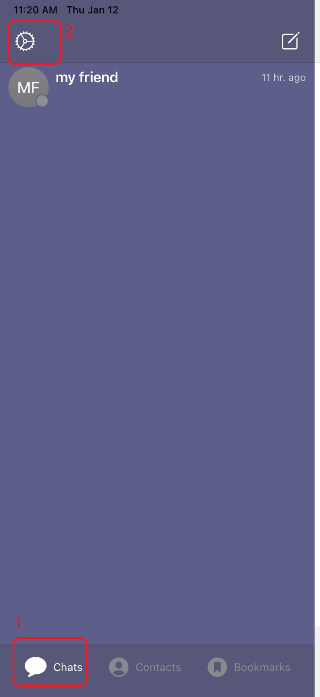
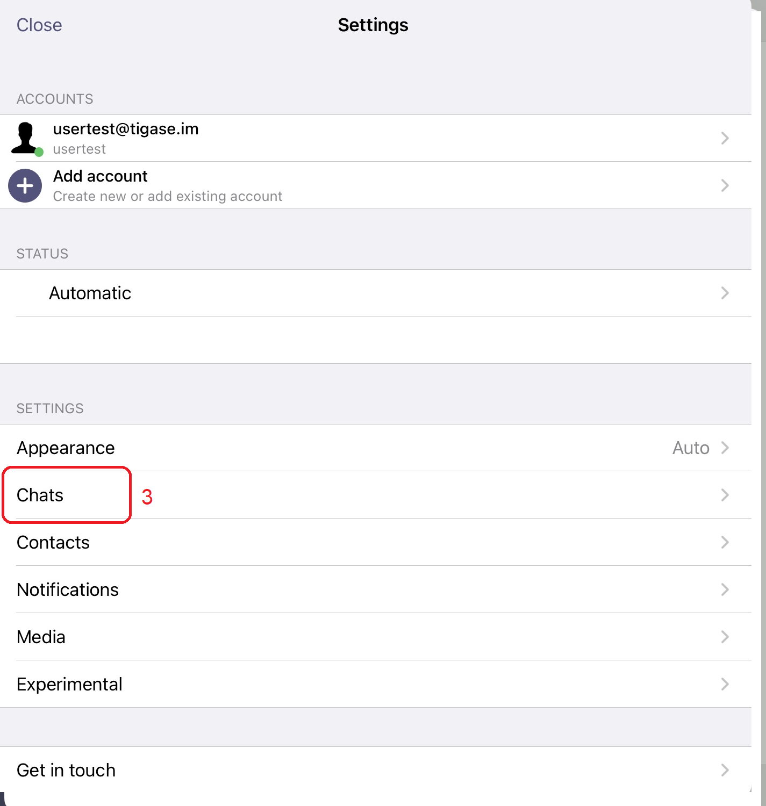
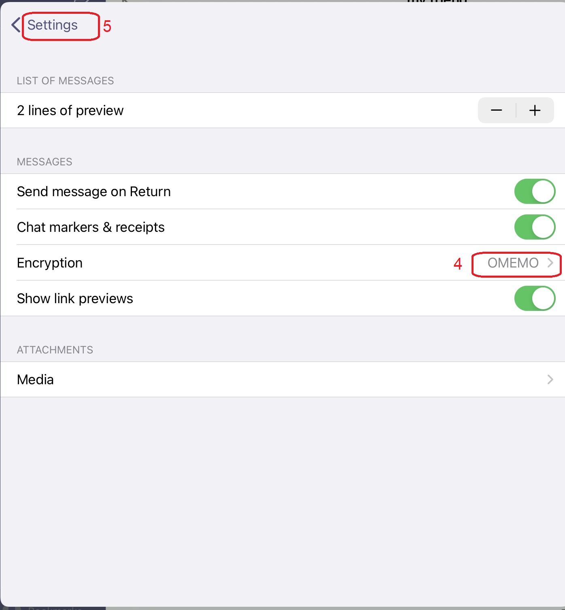
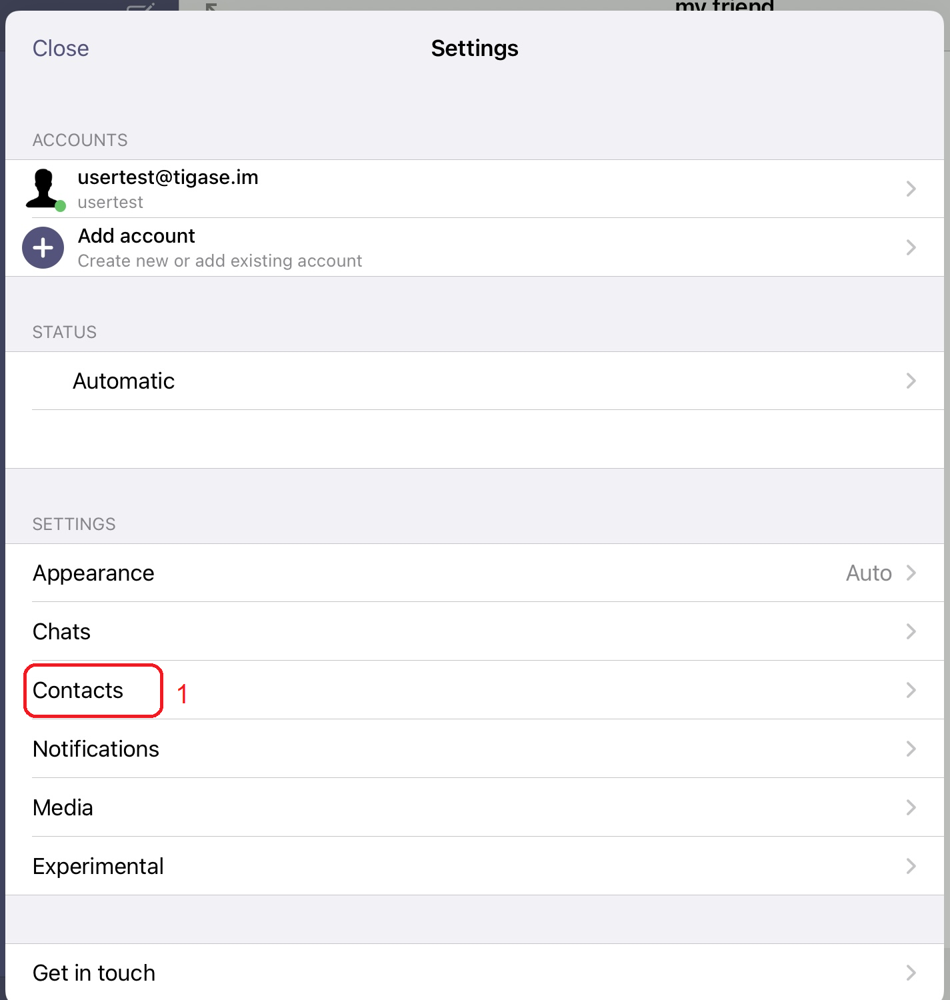
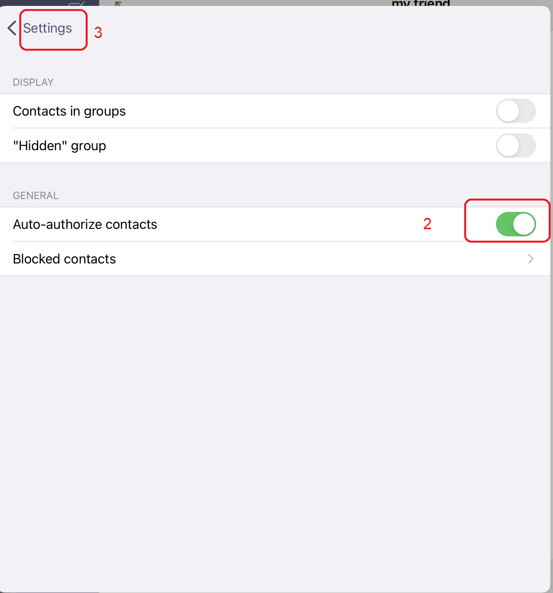
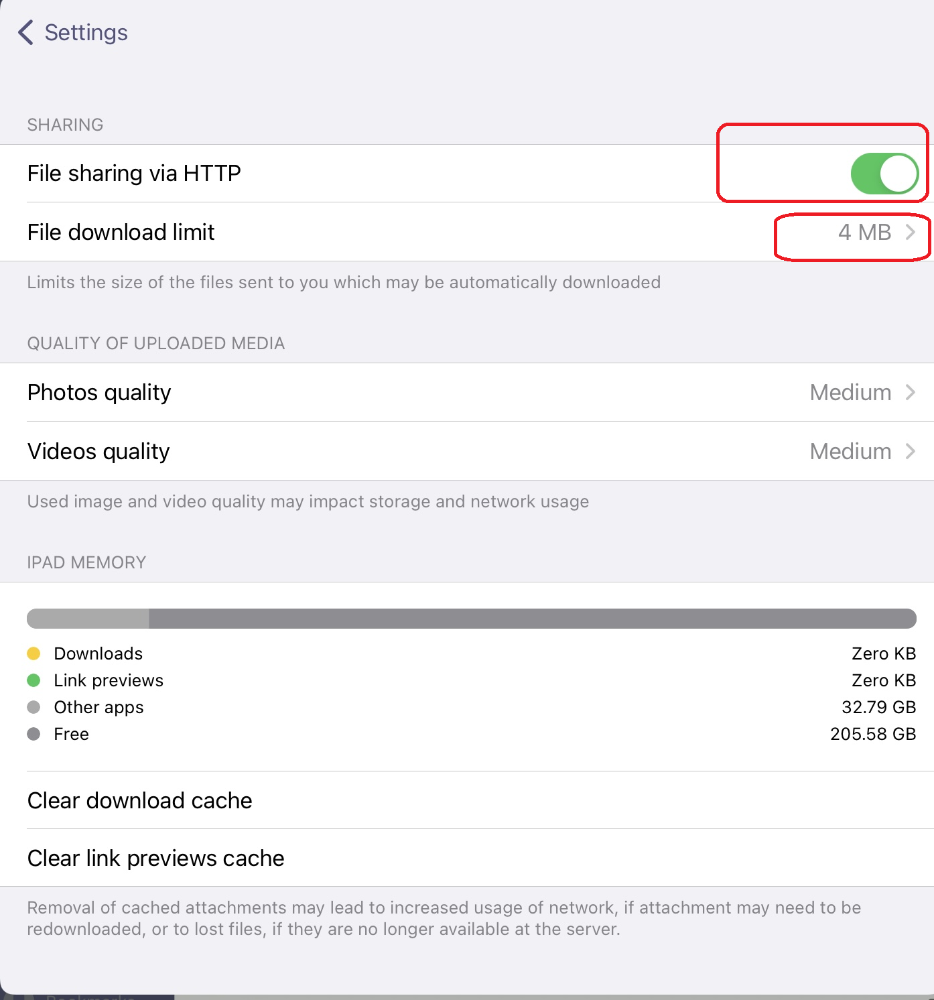
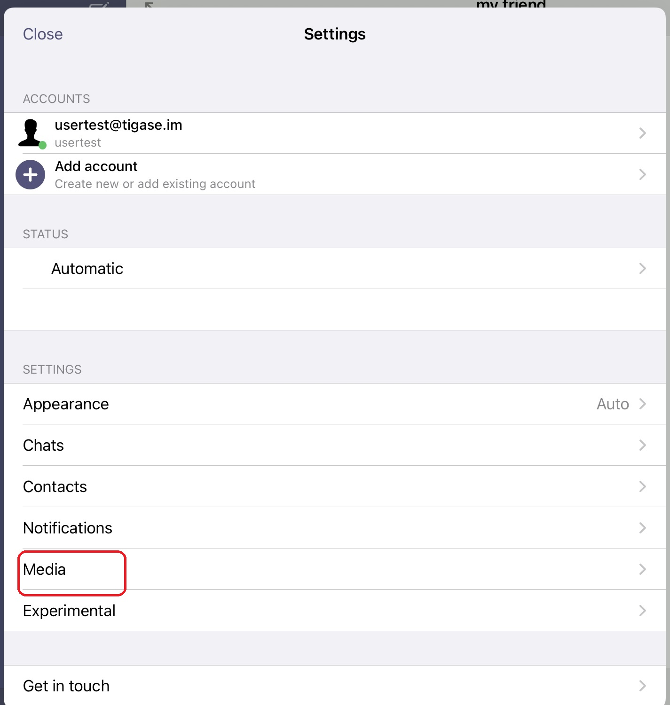
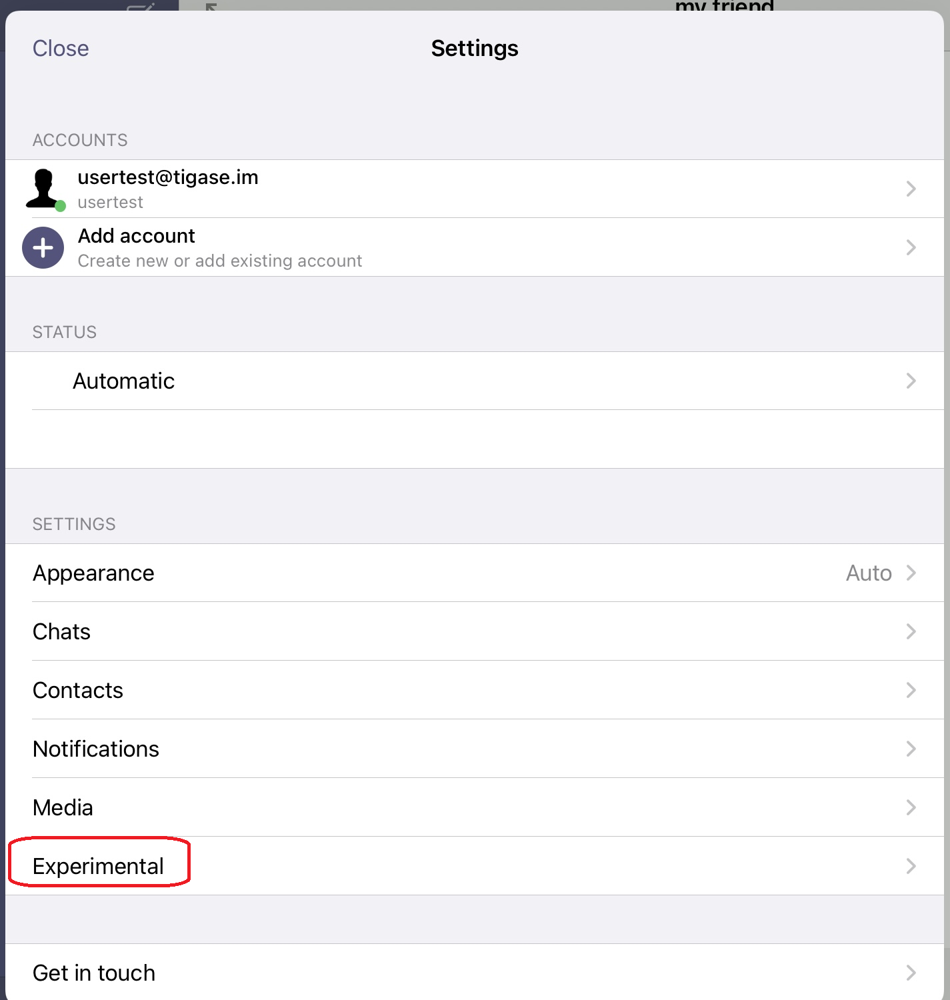

Advanced Options
=================

This section contains information about advanced settings and options that are available to the application, but may not be typically considered for users.

-  | activation of end-to-end-encryption
-  | requesting delivery receipts
-  | activation of auto-authorization of contacts
-  | optimization of settings for file exchange (files and pictures)
-  | activation of group chat synchronization

Chats
-------

First, you visit the settings menu by selecting Chats. Then you need to tap the upper left. In this submenu you can activate the end-to-end-encryption (called OMEMO). Afterwards, you go back to the settings menu by clicking Settings.

|images/setting01| |images/setting02| |images/setting03| 

Contacts
---------

In the settings menu you have to select Contacts. You activate the switch Auto-authorize contacts and you could return to the settings menu by clicking Settings. 

|images/setting04| |images/setting05| 

Media
------

In the settings menu you have to select Media.In this submenu you can optimize the settings for file exchange. You should select **File sharing via HTTP** and set the **File download limit** to 4 MB. Now you can send files and upload them to your XMPP server (instead of sending them directly to your communication partner). Files which you receive will be downloaded automatically if their size is below 4 MB.

|images/setting07| |images/setting06| 

Experimental
------------

In the settings menu you have to select select Experimental. Here you can activate the Groupchat bookmark sync to be able to see your group chats on multiple devices. Additionally, I recommend to deactive the usage of public STUN servers. Most todays XMPP servers already provide a STUN-service.

|images/setting08| 

After this step you can go back to the settings menu and close it. The optimization of settings is done.

