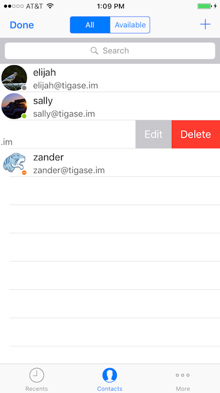
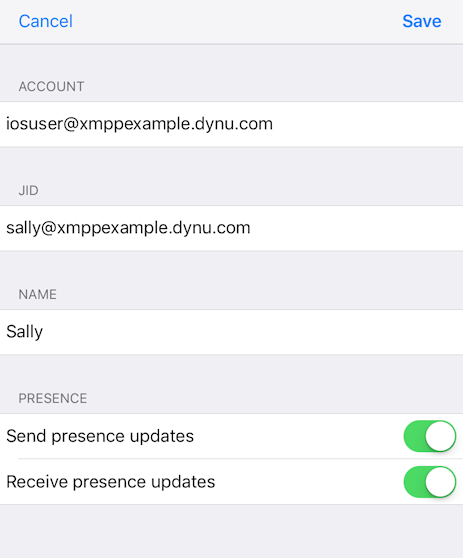
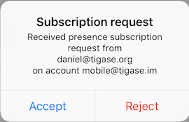
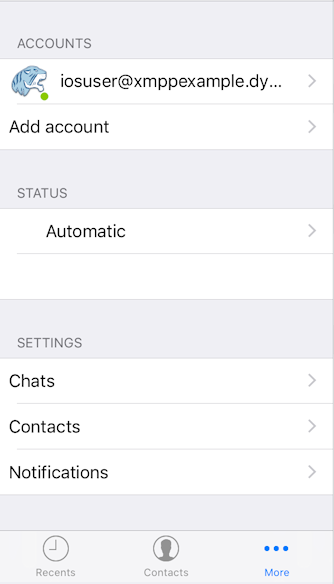
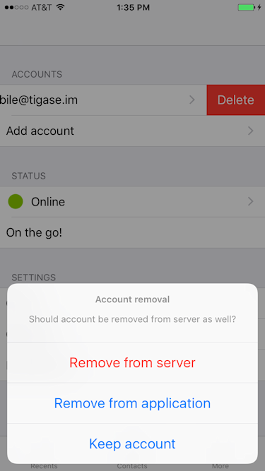

Tigase Messenger for iOS Interface
===================================

The menu interface for Tigase Messenger for iOS is broken up into three main panels; `Recent <#recent>`__, `Contacts <#contacts>`__ and `More <#more>`__. This can be brought up from any screen by swiping right from the left side of the screen, or tapping the back option on the top left.

The recent menu displays recent conversations with other users, and also serves as a way to navigate between multi-user chatrooms (MUCs). Each conversation will be displayed here along with an icon indicating user or room status.

|images/recent|

Tapping one of these conversations will bring up the chat, whether it is MUC or one on one. This panel also serves as an archive of sorts, and previous conversations with users will be accessible in this panel.

   **Note**

   Conversations will only be saved if they took place on this device, or if message archive is active.

You may clear conversations from the archive by dragging the name or MUC conversation to the left and selecting delete. If you are removing a MUC chat, you will leave the chatroom.

|images/delchat|

New/Join MUC
--------------

Tapping the plus button on the top right will bring up the new/join muc panel. This interface will allow you to either join an existing or create a new MUC on your chosen server.

|images/join|

-  Account: This is the account that will handle data for the MUC chatroom. This is available for users who have multiple accounts logged in.

-  Server: The server the chatroom is located on, in many cases the muc server will be muc.servername.com, but may be different.

-  Room: The name of the chatroom you wish to create or join.

-  Nickname: Your name for use inside the MUC. This will become ``yournickname@muc.server.com``. MUC conversations do not leak your XMPP account, so a nickname is required.

-  Password: The password for the MUC room. If you are creating a new chatroom, this will serve as the chat room password.

Once you are finished, tap Join and you will join, or the room will be opened for you.

The recent panel will now display the chatroom, you may tap it to enter the MUC interface.

When in a chatroom, you may view the occupants by tapping Occupants, and will be given a list and statuses of the room participants.

|images/occu|

The contacts panel serves as your Roster, displaying all the contacts you have on your roster, and displaying statuses along with their names. Tigase Messenger for iOS supports vCard-Temp Avatars and will retrieve them if they are uploaded by a user.

|images/roster|

| Contacts with green icons are available or free to chat status.
| Contacts with yellow icons are away or extended away.
| Contacts with red icons are in do not disturb status.
| Contacts with gray icons are offline or unavailable.

Note that contacts will remain gray if you decide not to allow presence notifications in the settings.

You may remove or edit contacts by dragging a contact to the left and tapping Delete. You also have the ability to edit a contact, explained in the next section. Deleting the contact will remove them from your roster, and remove any presence sharing permissions from the contact.

|images/deluser|

You may also filter contacts by status by selecting All to display all users, or Available to hide users that are offline or unavailable.

Editing a contact
-------------------

When editing a contact, you may chose to change the account that has friended the user, XMPP name, edit a roster name (which will be shown on your roster). Here, you may also decide to selectively approve or deny subscription requests to and from the user. If you do not send presence updates, they will not know whether you are online, busy, or away. If you elect not to receive presence updates, you will not receive information if they are online, busy or away.

|images/edituser|

Adding a contact
-----------------

To add a contact, tap the plus button in the upper left and the add contact screen will show.

|images/adduser|

First, select the account friends list you wish the new contact to be added too. Then type in the JID of the user, do not use resources, just bare JID. You may enter a friendly nickname for the contact to be added to your friend list, this is optional. When adding users, you have two options to select:

-  Send presence updates - This will allow sending of presence status and changes to this user on your roster. You may disable this to reduce network usage, however you will not be able to obtain status information.

-  Receive presence updates - Turning this on will enable the applications to send presence changes to this person on the roster. You may disable this to reduce network usage, however they will not receive notifications if you turn off the phone

.. Note::

   These options are on by default and enable Tigase Messenger for iOS to behave like a traditional client.

If you do decide to receive presence updates when adding a new contact, you will be presented with this screen when they add you back:

|images/presreq|

By tapping yes, you will receive notifications of presence changes from your contact. This subscription will be maintained by the server, and will stay active with your friends list.

.. Note::

   You will only receive this option if 'automatically accept presence requests' is set to yes in account settings.

.. Tip::

   If somebody not on your friends list adds you, you will receive this same message.

The more panel is your program and account settings panel, from here you can change program settings and general account information.

|images/settings|

Accounts
---------

This will list your current accounts, if an avatar has been defined for the account, it will show on the left side but by default the Tigase logo will be used.

vCard data
==========

You can set and change vCard data for your account. Tap the account you wish to edit and you will be presented with a number of fields that may be filled out. There is a blank space in the upper left corner where you may upload a photo as your avatar.

Badge descriptions
==================

We have included a badging system on accounts to help indicate if connections issues are present with any account setup.

+-----------------------+------------------------------------------------------------------------------------------------------------------------------------------------------------------------------------------------------------------------------------------------+
| Icon                  | Meaning                                                                                                                                                                                                                                        |
+-----------------------+------------------------------------------------------------------------------------------------------------------------------------------------------------------------------------------------------------------------------------------------+
| No icon               | If account is disabled and will not try to connect                                                                                                                                                                                             |
+-----------------------+------------------------------------------------------------------------------------------------------------------------------------------------------------------------------------------------------------------------------------------------+
| Red icon with a cross | Account is disabled and will not try to connect due to server reporting an error (persistent error, i.e. authentication error).                                                                                                                |
+-----------------------+------------------------------------------------------------------------------------------------------------------------------------------------------------------------------------------------------------------------------------------------+
| Grey                  | Account attempts to connect but is unable to connect to server (usually it means client is unable to establish TCP connection with the server) In this state, account tries to reconnect every few seconds if the client is in the foreground. |
+-----------------------+------------------------------------------------------------------------------------------------------------------------------------------------------------------------------------------------------------------------------------------------+
| Orange with dots      | TCP connection is established but XMPP stream is not ready yet (not authorized yet, awaiting resource binding, etc).                                                                                                                           |
+-----------------------+------------------------------------------------------------------------------------------------------------------------------------------------------------------------------------------------------------------------------------------------+
| Green                 | XMPP client is connected and XMPP stream is established and ready to send/receive stanzas.                                                                                                                                                     |
+-----------------------+------------------------------------------------------------------------------------------------------------------------------------------------------------------------------------------------------------------------------------------------+

Delete an account
---------------------

If you wish to remove an account, swipe left and select Delete. You will be asked for a confirmation whether you want to remove it from the application, and if the server supports it, you may delete it from the server removing roster, presence subscriptions, and potentially saved history.

|images/delacct|

.. Warning::

    Deleting your account from the server is a permanent and non-reversible action.

You may also add multiple XMPP accounts from this screen. The add account screen looks identical to the one seen in the `existing account <#existing>`__ section.

To change settings for an individual account, tap that account name. Those options are covered under `Account Settings <#acctSettings>`__ section.

Status
-------

Below accounts is a status setting for all connected and online accounts.

To save data usage, your account status will be managed automatically using the following rules by default

+-----------+--------------------------------------------------------------------------------------------------------------------------------+
| Status    | Behavior                                                                                                                       |
+-----------+--------------------------------------------------------------------------------------------------------------------------------+
| Online    | Application has focus on the device.                                                                                           |
+-----------+--------------------------------------------------------------------------------------------------------------------------------+
| Away / XA | Application is running in the background.                                                                                      |
+-----------+--------------------------------------------------------------------------------------------------------------------------------+
| Offline   | Application is killed or disconnected. If the device is turned off for a period of time, this will also set status to offline. |
+-----------+--------------------------------------------------------------------------------------------------------------------------------+

However, you may override this logic by tapping Automatic and selecting a status manually.

|images/setstatus|

Show tag
^^^^^^^^^

Underneath is a blank space where you can set your show tag

Editing this text section will change the ``<show>`` tags in your status. Once you press OK, your new show tag will display.

Below are settings for the operation and behavior of the application.

|images/chatsettings|

Chats
------

**List of Messages**

-  | Lines of preview:
   | Sets the lines of preview text to keep within the chat window without using internal or message archive.

-  | Sorting:
   | Allows sorting of recent messages by Time, or by status and time (with unavailable resources at the bottom).

**Messages**

-  | Send messages on return:
   | If you are offline or away from connection, messages may be resent when you are back online or back in connection if this option is checked.

-  | Clear chat on close:
   | If this is enabled, when you close chats from the recent screen, all local history on the device will be deleted. This does not affect operation of offline or server-stored message archives.

-  | Message carbons:
   | Enables or disables message carbons to deliver to all resources. This is on by default, however some servers may not support this.

-  | Request delivery receipts:
   | Whether or not to request delivery receipts of messages sent.

**Attachments**

-  | File sharing via HTTP:
   | This setting turns on the use of HTTP file sharing using the application. The server you are connected too must support this component to enable this option.

-  | Simplified link to HTTP file:
   | This creates a simplified link to the file after uploading rather than directly sending the file. This may be useful for intermittent communications.

-  | Max image preview size:
   | Sets the maximum size of image previews to download before fully downloading files. Setting this at 0 prevents previews from retrieving files.

-  | Clear cache:
   | This clears the devices cache of all downloaded and saved files retrieved from HTTP upload component.

Contacts
---------

**Display**

-  | Contacts in groups:
   | Allows contacts to be displayed in groups as defined by the roster. Disabling this will show contacts in a flat organization.

-  | "Hidden" group:
   | Whether or not to display contacts that are added to the "hidden" group.

**General**

-  | Auto-authorize contacts:
   | Selecting this will automatically request subscription to users added to contacts.

Notifications
--------------

This section has one option: Whether to accept notifications from unknown. If left disabled, notifications from unknown sources (including server administrators) will not be sent to the native notification section of the device. Instead, you will have to see them under the Recent menu.

.. |images/recent| image:: ../images/recent.png
.. |images/delchat| image:: ../images/delchat.png
.. |images/join| image:: ../images/join.png
.. |images/occu| image:: ../images/occu.png
.. |images/roster| image:: ../images/roster.PNG

.. |images/adduser| image:: ../images/adduser.png

.. |images/setstatus| image:: ../images/setstatus.png
.. |images/chatsettings| image:: ../images/chatsettings.png

