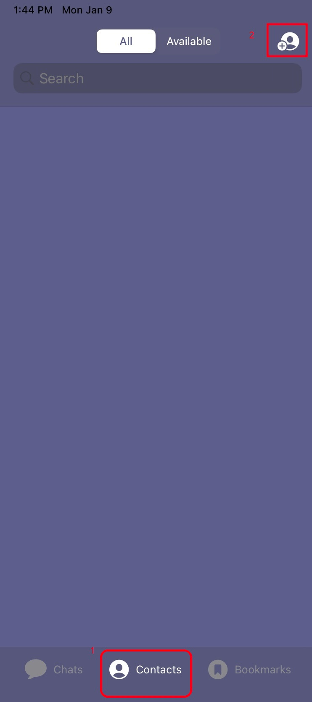
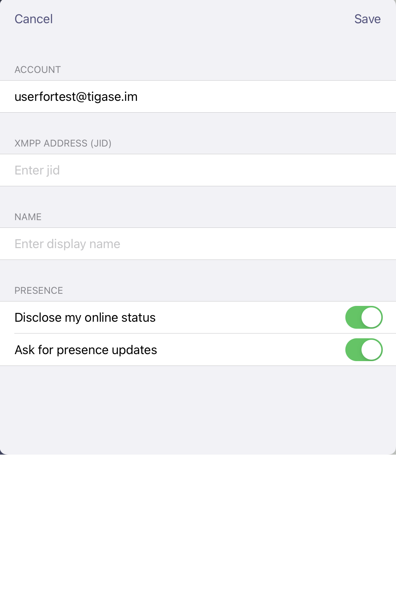
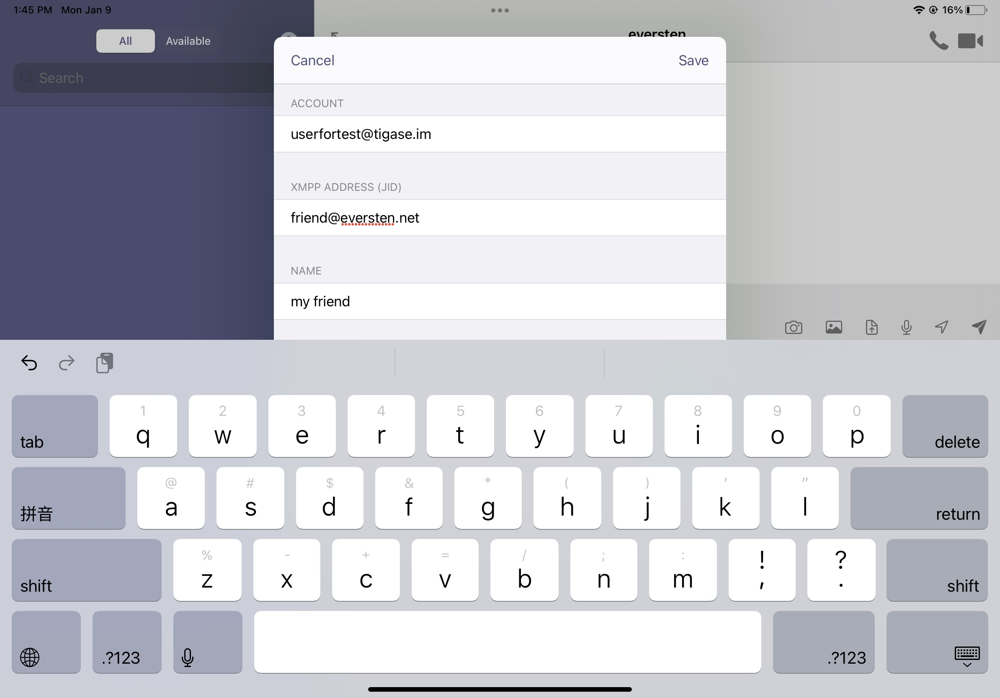
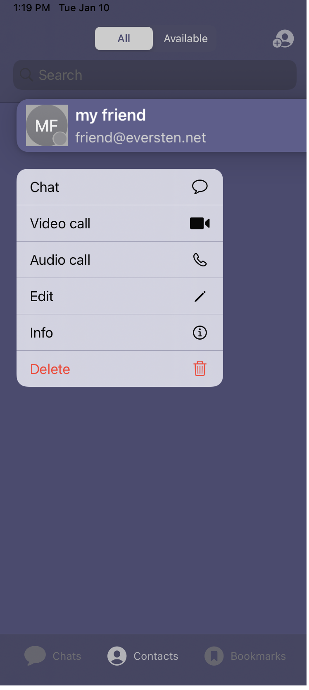
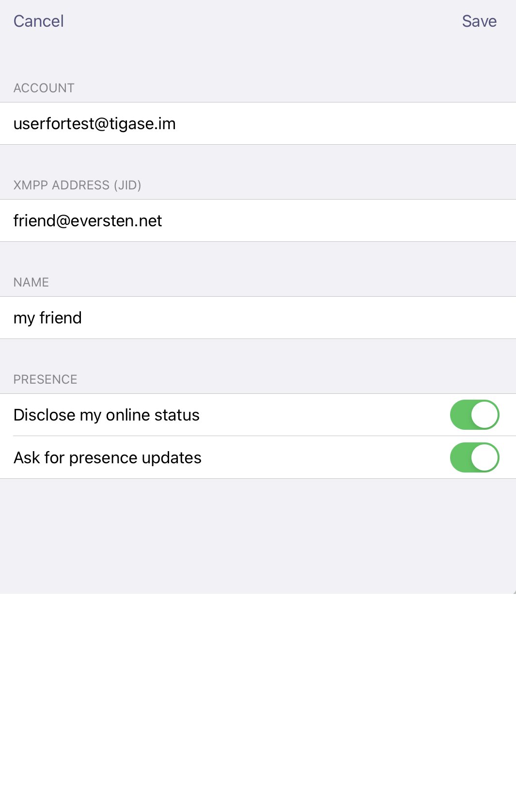
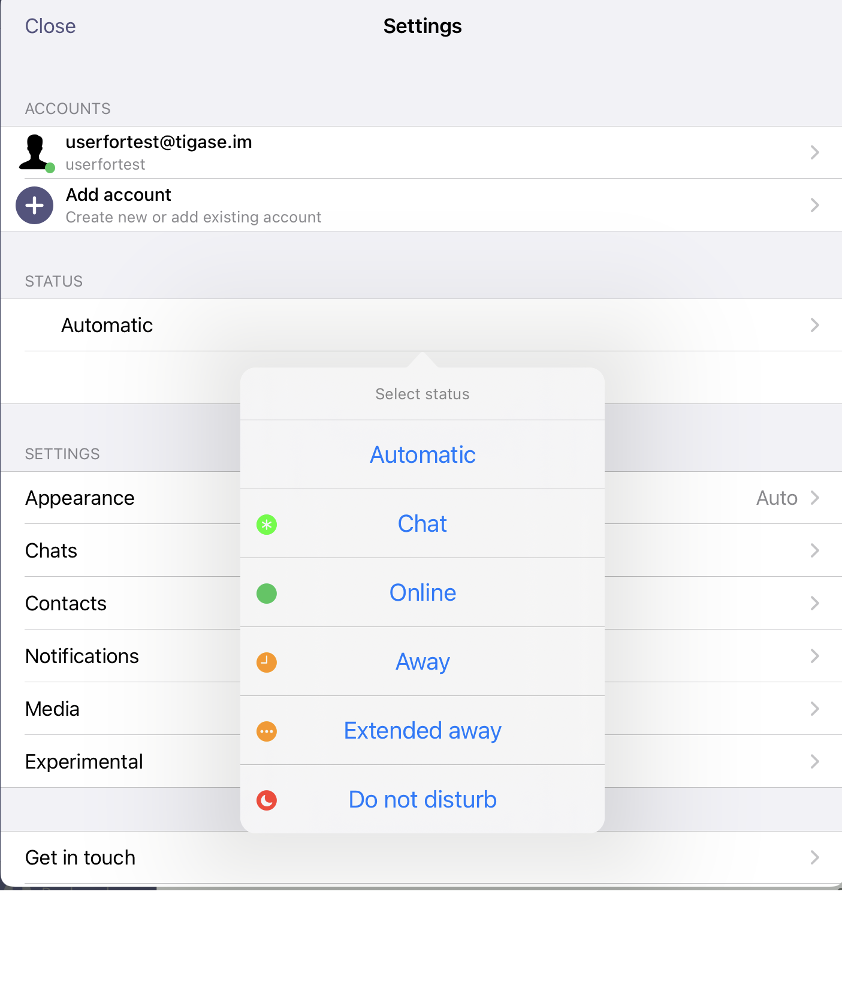

Tigase Messenger for iOS Interface
======================================

The menu interface for Tigase Messenger for iOS is broken up into three main panels; Chats, Contacts and Bookmarks. 

Contacts
---------

The contacts panel serves as your Roster, displaying all the contacts you have on your roster, and displaying statuses along with their names. Tigase Messenger for iOS supports vCard-Temp Avatars and will retrieve them if they are uploaded by a user.

Contacts with green icons are available or free to chat status.
Contacts with yellow icons are away or extended away.
Contacts with red icons are in do not disturb status.
Contacts with gray icons are offline or unavailable.

Note that contacts will remain gray if you decide not to allow presence notifications in the settings.

You may delete or edit contacts by tapping a contact and tapping Delete. You also have the ability to edit a contact, explained in the next section. Deleting the contact will remove them from your roster, and remove any presence sharing permissions from the contact.

Adding a contact
^^^^^^^^^^^^^^^^^

To add a contact, you have to click on Contacts and select the +-sign at the top of the screen. Select the account friends list you wish the new contact to be added too. Then type in the JID of the user, do not use resources, just bare JID. You may enter a friendly nickname for the contact to be added to your friend list.In this tutorial *my friend* is selected as the name for the contact. When adding users, you have two options to select:

|images/siskin03|  |images/join01|

|images/join02|

-  Disclose my online status - This will allow sending of presence status and changes to this user on your roster. You may disable this to reduce network usage, however you will not be able to obtain status information.

-  Ask for presence updates - Turning this on will enable the applications to send presence changes to this person on the roster. You may disable this to reduce network usage, however they will not receive notifications if you turn off the phone

.. Note::

   These options are on by default and enable Tigase siskin IM for iOS to behave like a traditional client.

Editing a contact
^^^^^^^^^^^^^^^^^^^^^

When editing a contact, you may chose to change the account that has friended the user, XMPP name, edit a roster name (which will be shown on your roster). Here, you may also decide to selectively approve or deny subscription requests to and from the user. If you do not send presence updates, they will not know whether you are online, busy, or away. If you elect not to receive presence updates, you will not receive information if they are online, busy or away.

Tap the contact you want to edit, click "edit", after it is done, click "save"

|images/editcontacts01| |images/editcontacts02| 

Settings
---------

click "Chats" on the bottom of mian panel and click the upper left, below are settings for the operation and behavior of the application.

Automatic
^^^^^^^^^^

To save data usage, your account status will be managed automatically using the following rules by default

+-----------+--------------------------------------------------------------------------------------------------------------------------------+
| Status    | Behavior                                                                                                                       |
+-----------+--------------------------------------------------------------------------------------------------------------------------------+
| Online    | Application has focus on the device.                                                                                           |
+-----------+--------------------------------------------------------------------------------------------------------------------------------+
| Away / XA | Application is running in the background.                                                                                      |
+-----------+--------------------------------------------------------------------------------------------------------------------------------+
| Offline   | Application is killed or disconnected. If the device is turned off for a period of time, this will also set status to offline. |
+-----------+--------------------------------------------------------------------------------------------------------------------------------+

However, you may override this logic by tapping Automatic and selecting a status manually.

|images/status|

Apperance
^^^^^^^^^^

-  | auto, light and dark
   | adjust background brightness

Chats
^^^^^^^

-  | Lines of preview:
   | Sets the lines of preview text to keep within the chat window without using internal or message archive.

-  | Send messages on return:
   | If you are offline or away from connection, messages may be resent when you are back online or back in connection if this option is checked.

-  | Chat markers & reeipts:
   | Whether or not the message has been read by the receipts.

Contacts
^^^^^^^^^

-  | Contacts in groups:
   | Allows contacts to be displayed in groups as defined by the roster. Disabling this will show contacts in a flat organization.

-  | "Hidden" group:
   | Whether or not to display contacts that are added to the "hidden" group.

-  | Auto-authorize contacts:
   | Selecting this will automatically request subscription to users added to contacts.

Notifications
^^^^^^^^^^^^^

-  | Notifications from unknown
   | whether or not notifications from unknown sources will be sent to the native notification section of the device.

-  | Push notifications
   | whether or not notificaitons of new messages or calls will be received

This section has one option: Whether to accept notifications from unknown. 

Media
^^^^^^^^^^^^^

-  | File sharing via HTTP:
   | This setting turns on the use of HTTP file sharing using the application. The server you are connected to must support this component to enable this option.

-  | Simplified link to HTTP file:
   | This creates a simplified link to the file after uploading rather than directly sending the file. This may be useful for intermittent communications.

-  | File download limit:
   | Sets the maximum size of files being sent to the user which may be automatically donwload.

-  | Clear download cache:
   | User can choose clears the devices cache of all downloaded and saved files retrieved from HTTP upload component or older than 7 days.

-  | Clear link previews cache:
   | User can choose clears the devices cache of all previews or older than 7 days.

Vcard
^^^^^^

You can set and change vCard data for your account. Tap the account you wish to edit and you will be presented with a number of fields that may be filled out. Click "change avatar" at the top where you may upload a photo as your avatar.

