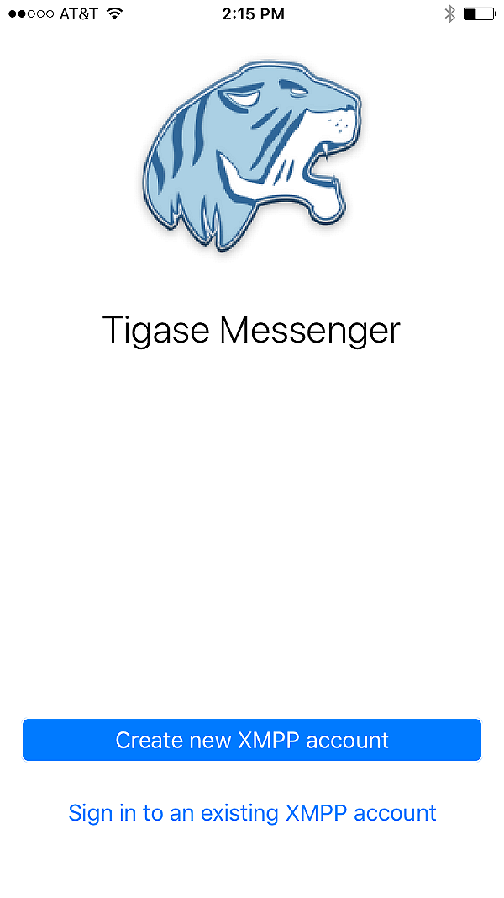

Welcome
========

Welcome to the documentation for Tigase Messenger for iOS.

Minimum Requirements
--------------------------

Tigase Messenger for iOS requires an apple device running iOS v10 or later. Compatible devices are listed below:

| **iPhone**
| - iPhone 5
| - iPhone 5C
| - iPhone 5S
| - iPhone 6
| - iPhone 6 Plus
| - iPhone 6S
| - iPhone 6S Plus
| - iPhone 7
| - iPhone 7 Plus
| - iPhone SE

| **iPod Touch**
| - iPod Touch (6th generation)

| **iPad**
| - iPad (4th generation)
| - iPad (5th generation)
| - iPad Air
| - iPad Air 2
| - iPad Mini 2
| - iPad Mini 3
| - iPad Mini 4
| - iPad Pro

Installation
-------------

Tigase Messenger for iOS can be installed the same way any apple approved app can be found: through the appstore. Search for Tigase in the store search function and then tap install and follow the prompts to install Tigase Messenger.

Account Setup
--------------

Upon running Tigase Messenger for iOS for the first time, you will be greeted with the following screen:

|images/home|

Your options are to `register <#reg>`__ for a new account, or to use an `existing <#existing>`__ account.

**Registering for a New Account**

The application supports creating a new account registration using in-band registration. This means that on servers supporting it, you can sign up for a new account straight from the client! A list of servers that support this is located `here <https://list.jabber.at/>`__. We have provided quick-links to Tigase maintained servers where you can register an account. However, you may use another domain if you wish. If you wish to use a custom domain, enter the domain address in the top bar, the application will then check with the server to ensure registration is supported.

You will be presented with an error message if it is not supported.

|images/regfailure|

If registration is supported, you will see the following prompts:

|images/registernew|

Fill out the fields for username, password, and E-mail. You do not need to add the domain to your username, it will be added for you so your JID will look like ``yourusername@domain.com``

An E-mail is required in case a server administrator needs to get in contact with you, or you lose your password and might need recovery.

Once you tap Register, the application will connect and register your account with the server.

**Use an Existing Account**

If you already have an XMPP account on a server, select this option to login using Tigase Messenger for iOS. Enter your username and password as normal and tap Save to add the account.

.. Note::

   Your device name will serve as the resource for your account. iPad or iPhone will automatically be used as the resource.

Certificate Errors
^^^^^^^^^^^^^^^^^^^^^

You may receive certificate errors from servers that may not have certificate chains installed, invalid, or expired certificates. You will receive an unable to connect to server error, however servers with these errors will ask the user to accept or deny these security exceptions but they will show up at system notifications.

After doing so you may reattempt the connection to the server.

Final Steps
------------

Once your account is verified, the application will log you in as online and display the recent screen.

.. |images/regfailure| image:: ../images/regfailure.png
.. |images/registernew| image:: ../images/registernew.png

