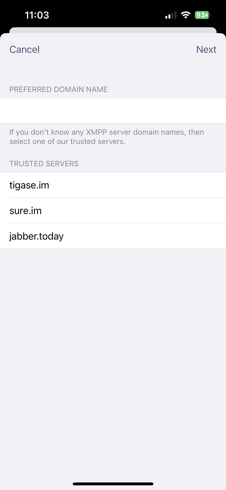
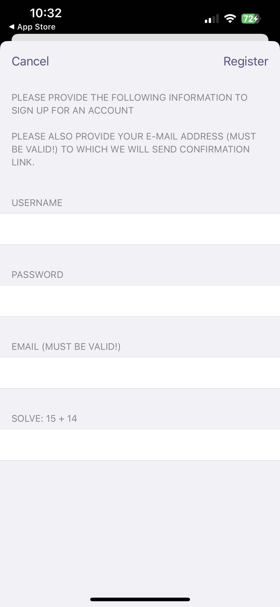
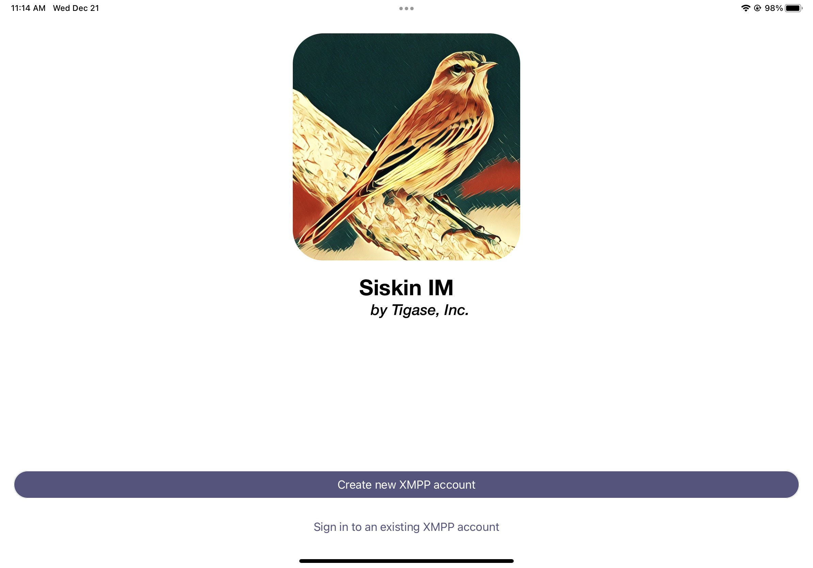
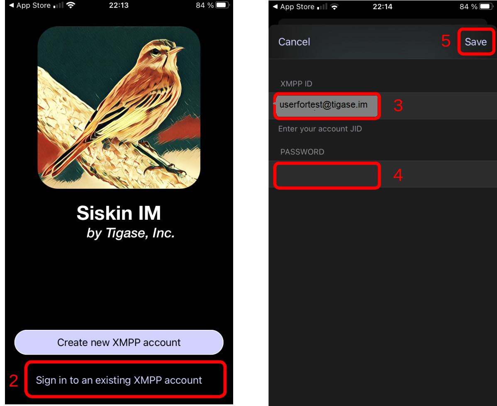

Welcome
========

Welcome to the documentation for Siskin IM for iOS.

Siskin IM has some nice feature:

encrypted chats and group chats
sending and receiving files/pictures
audio- and videocalls
recording and sending voice messages (Siskin IM 7.0)
Sending your geolocation (Siskin IM 7.0)

Minimum Requirements
--------------------------

**iPhone**
Requires iOS 13.0 or later.

**iPad**
Requires iPadOS 13.0 or later.

**iPod touch**
Requires iOS 13.0 or later.

**Mac**
Requires macOS 11.0 or later and a Mac with Apple M1 chip or later.

Installation
-------------

Siskin IM is a good choice if you want to use an XMPP account on your iPhone or iPad. You can get Siskin IM from the App Store (`external <https://apps.apple.com/us/app/siskin-im/id1153516838>`__ ). Please keep in mind that Siskin IM is available in English only.

Account Setup
----------------------------

After downloading Siskin IM from the App Store you can start it by clicking the Siskin IM icon. At first Siskin IM asks if it is allowed to send notifications. You should allow Siskin IM to do so.

Your options now are to creat new XMPP account, or to use an existing XMPP account(if you do not already have one). 

Registering for a New Account
^^^^^^^^^^^^^^^^^^^^^^^^^^^^^^^^

You have the choice between a lot of different XMPP providers. Your XMPP address will be the username you choose followed by the @-sign and the domain of the chosen provider.

Some examples for XMPP providers are:

magicbroccoli.de: Registration (`external <https://magicbroccoli.de/register/>`__ ). 
wiuwiu.de: Registration (`external link <https://wiuwiu.de/>`__ ). 
You can also choose a provider by looking at this list: (`external <https://apps.apple.com/us/app/siskin-im/id1153516838>`__ ). 

If you do not know any XMPP server domain names, then you could select one of trusted servers from the list of sisin IM provided.

|images/register01|

After you select trusted servers, Fill out the fields for username, password, and E-mail. You do not need to add the domain to your username, it will be added for you so your JID will look like yourusername@domain.com

|images/register02|

An E-mail is required in case a server administrator needs to get in contact with you, or you lose your password and might need recovery.

Once you tap Register, the application will connect and register your account with the server. And you will receive the email confirmation with the link to confirm the new XMPP account.

Use an Existing Account
^^^^^^^^^^^^^^^^^^^^^^^^

Now you select Sign in to an existing XMPP account since you already registered an address in the previous section. Afterwards, you have to enter your XMPP address, your password and finish these steps by clicking Save. Please keep in mind that in this tutorial the XMPP address userfortest@tigase.im is used as an example account.

|images/siskin01|

|images/siskin02|

You will see a notification, which asks if you want to allow the Siskin server to send you Push Notifications. You should **enable** this setting to get notifications (even if the app is in the background). Siskin will now show you your XMPP address and that the setting Message Synchronization is activated. You can simply click on Done.

Your XMPP address is now configured to be used in Siskin IM. 

Final Steps
------------
Once your account is verified, the application will log you in as online and display the chat screen.

